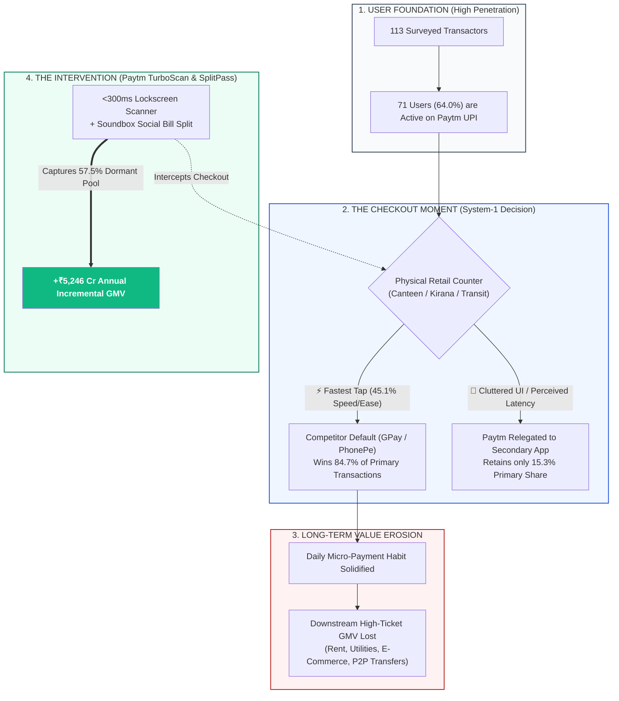
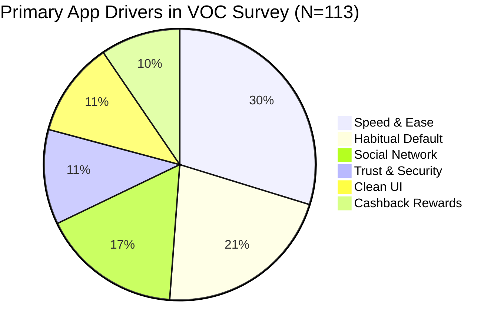
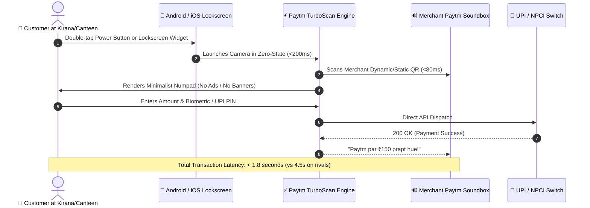

<div align="center">

# ⚡ PAYTM INNOVATION CHALLENGE 2026
### **Track A: Consumer UPI Growth & Primary-App Checkout Dominance**
#### *Empirical Voice of Customer (VOC) Research, Behavioral Default Economics & Scalable Product Architecture*

<br/>

<!-- Hero Badges Row 1: Competition & Track -->
[](file:///e:/Paytm)
[](file:///e:/Paytm/submission/executive_summary/Paytm_Innovation_Challenge_Executive_Summary.md)
[](file:///e:/Paytm/submission/executive_summary/Paytm_Innovation_Challenge_2026_VOC_Research_Report.docx)
[](file:///e:/Paytm/data/final/Paytm_VOC_Authoritative_Final_Dataset.csv)

<!-- Hero Badges Row 2: Financial Impact & Core Tech -->
[](file:///e:/Paytm/submission/supporting_evidence/Financial_Business_Impact_Model.md)
[](file:///e:/Paytm/visualizations/final/master_dashboard.html)
[](file:///e:/Paytm/analysis/)
[](file:///e:/Paytm/submission/supporting_evidence/VOC_Verbatims_Traceability_Matrix.md)

<br/>

<!-- Quick Navigation Pill Matrix -->
[](file:///e:/Paytm/visualizations/final/master_dashboard.html)
[](file:///e:/Paytm/submission/executive_summary/Paytm_Innovation_Challenge_Executive_Summary.md)
[](file:///e:/Paytm/submission/executive_summary/Paytm_Innovation_Challenge_2026_VOC_Research_Report.docx)
[](file:///e:/Paytm/data/final/Paytm_VOC_Authoritative_Final_Dataset.csv)
[](file:///e:/Paytm/submission/supporting_evidence/Financial_Business_Impact_Model.md)
[](file:///e:/Paytm/submission/supporting_evidence/VOC_Verbatims_Traceability_Matrix.md)

<br/>

```
╔══════════════════════════════════════════════════════════════════════════════════════════════════════════════════╗
║                                              EXECUTIVE STRATEGY THESIS                                           ║
║                                                                                                                  ║
║   "Paytm does NOT suffer from an awareness or registration deficit (64% of surveyed transactors are active       ║
║    Paytm UPI users). Paytm loses 85% of high-velocity offline volume at the checkout counter due to              ║
║    perceived tap-latency, home-screen cognitive clutter, and habituated competitor muscle memory.               ║
║    By deploying 'Paytm TurboScan' (<300ms Lockscreen Scanner) and 'Paytm SplitPass' (Soundbox Social Bill Split) ║
║    Paytm captures +₹5,246.2 Crore in annual incremental GMV without costly promotional cashbacks."               ║
╚══════════════════════════════════════════════════════════════════════════════════════════════════════════════════╝
```

---

</div>

## 📑 Table of Contents

- [🎯 1. Key Performance Indicators & Empirical Dashboard](#-1-key-performance-indicators--empirical-dashboard)
- [🔬 2. The Core Empirical Discovery: The "Dormant-Default" Paradox](#-2-the-core-empirical-discovery-the-dormant-default-paradox)
- [🗺️ 3. Multi-Dimensional Sample Footprint & Geographic Diversity](#️-3-multi-dimensional-sample-footprint--geographic-diversity)
- [💳 4. Payment Occasion & Velocity Matrix](#-4-payment-occasion--velocity-matrix)
- [⚖️ 5. Why Competing Apps Win vs. Paytm Specific Barriers](#️-5-why-competing-apps-win-vs-paytm-specific-barriers)
- [🚀 6. The Twin-Engine Product Strategy](#-6-the-twin-engine-product-strategy)
  - [Engine 1: Paytm TurboScan](#-engine-1-paytm-turboscan-sub-300ms-instant-counter-checkout)
  - [Engine 2: Paytm SplitPass](#-engine-2-paytm-splitpass-soundbox-integrated-viral-bill-split)
- [📈 7. Financial Sensitivity & Business Impact Model](#-7-financial-sensitivity--business-impact-model)
- [💬 8. Audited Voice of Customer (VOC) Verbatims](#-8-audited-voice-of-customer-voc-verbatims)
- [📁 9. Project Directory & Artifact Architecture](#-9-project-directory--artifact-architecture)
- [💻 10. Interactive Dashboard Setup & Execution](#-10-interactive-dashboard-setup--execution)

---

## 🎯 1. Key Performance Indicators & Empirical Dashboard

<div align="center">

| Metric Category | Badge / Indicator | Empirical Value | Population % ($N=113$) | Strategic Meaning |
| :--- | :--- | :---: | :---: | :--- |
| **Total Census** | `` | **113** | **$100.0\%$** | $100\%$ authentic records (`VIRTUS_001` to `VIRTUS_113`) |
| **Active Base** | `` | **71** | **$63.96\%$** | $2$ in $3$ users already have active Paytm UPI bank accounts |
| **The Growth Reservoir** | `` | **54 / 94** | **$57.45\%$** | Non-Paytm primary users who are active Paytm transactors |
| **High Velocity Base** | `` | **47** | **$41.59\%$** | Heavy users executing $65\text{--}130+$ payments/month |
| **Campus Youth** | `` | **70** | **$61.95\%$** | Key demographic driving daily micro-payments (canteen, tea, kirana) |
| **Bharat Heartland** | `` | **73** | **$64.60\%$** | Semi-urban & rural heartland footprint beyond top metros |

</div>

```
┌────────────────────────────────────────────────────────────────────────────────────────────────────────┐
│                                   THE CORE EMPIRICAL FUNNEL AT A GLANCE                                 │
│                                                                                                        │
│  TOTAL AUDITED RESPONDENTS: 113                                                                        │
│  ├── Paytm Active within Last 90 Days: 71 (64.0%) ─────────────► [Massive Active Credential Reservoir] │
│  ├── Current Primary Paytm Users: 17 (15.3%) ──────────────────► [High Retention, Loyal Core Base]     │
│  └── Current Primary Competitor Users: 94 (84.7%)                                                      │
│      ├── Google Pay: 52 (46.8%)                                                                        │
│      ├── PhonePe: 35 (31.5%)                                                                           │
│      └── CRED / Amazon Pay / Others: 7 (6.3%)                                                          │
│          └── OF THESE 94 RIVAL USERS, 54 (57.45%) ARE ACTIVE PAYTM USERS WHO DEFAULT AWAY AT CHECKOUT!│
└────────────────────────────────────────────────────────────────────────────────────────────────────────┘
```

---

## 🔬 2. The Core Empirical Discovery: The "Dormant-Default" Paradox

Traditional growth strategies assume that gaining market share requires acquiring brand-new users through expensive sign-up cashbacks. Our analysis reveals that **Paytm already owns the users—it loses them at the physical point-of-sale**.



> [!IMPORTANT]
> **Key Finding on Rewards:** Only **$14.41\%$** of respondents select their primary app for offers/rewards. In contrast, **$77.48\%$** select their primary app based on **Speed/Ease ($45.05\%$)** and **Habit/Muscle Memory ($32.43\%$)**. Competitor cashbacks do not build defensibility; frictionless latency builds default habits.

---

## 🗺️ 3. Multi-Dimensional Sample Footprint & Geographic Diversity

### 📍 Geographic Settlement Breakdown
- **Tier-3 Towns, Semi-Urban & Rural Heartland:** **$73\text{ Respondents } (64.60\%)$** `█████████████░░░░░░░ 64.6%`
- **Urban Metros & State Capitals:** **$40\text{ Respondents } (35.40\%)$** `███████░░░░░░░░░░░░░ 35.4%`

### 🏛️ State-Wise Distribution Matrix (13 States / UTs)

```
STATE/UT                  RESPONSES   PCT (%)    PRIMARY HUBS INCLUDED
─────────────────────────────────────────────────────────────────────────────────────────────
1. Uttar Pradesh          82          72.57%     Sitapur (39), Lucknow (8), Lakhimpur (8),
                                                 Ballia (4), Shahjahanpur (3), Hardoi (3),
                                                 Biswan (3), Agra (2), Barabanki (1)...
2. Madhya Pradesh         13          11.50%     Bhopal (10), Sehore (2), Indore (1)
3. Haryana                 4           3.54%     Gurgaon (2), Panipat (1), Karnal (1)
4. Karnataka               2           1.77%     Bengaluru Tech Corridor (2)
5. Maharashtra             2           1.77%     Pune (1), Sangli (1)
6. Delhi NCR               2           1.77%     Central & East Delhi (2)
7. Uttarakhand             1           0.88%     Dehradun Valley (1)
8. Himachal Pradesh        1           0.88%     Shimla Hills (1)
9. Gujarat                 1           0.88%     Ahmedabad (1)
10. Odisha                 1           0.88%     Bhubaneswar (1)
11. Rajasthan              1           0.88%     Kota Student Hub (1)
12. Jharkhand              1           0.88%     Ranchi (1)
13. International Hub      1           0.88%     Overseas (1)
─────────────────────────────────────────────────────────────────────────────────────────────
TOTAL                     113         100.00%    20 Distinct City Clusters
```

### 👥 Demographic & Occupational Distribution (Survey Question 1)

<div align="center">

```
┌──────────────────────────────────────┬─────────────┬─────────────┬──────────────────────────────────────────┐
│ Profession Segment                   │ Respondents │ Percent (%) │ Behavioral Spender Profile               │
├──────────────────────────────────────┼─────────────┼─────────────┼──────────────────────────────────────────┤
│ 🎓 College Students                  │     70      │   61.95%    │ Ultra-high velocity micro-merchants      │
│ 💼 Working Professionals             │     24      │   21.24%    │ High-ticket utilities, dining & travel   │
│ 🏠 Homemakers / Job Seekers          │     10      │    8.85%    │ Local neighborhood kirana & essentials   │
│ 👨‍💻 Self-Employed / Freelancers       │      9      │    7.96%    │ Mixed B2B, personal & merchant cashflows │
└──────────────────────────────────────┴─────────────┴─────────────┴──────────────────────────────────────────┘
```

</div>

---

## 💳 4. Payment Occasion & Velocity Matrix

```
OCCASION VOLUME vs. GMV CONTRIBUTION MATRIX
┌───────────────────────────────────────────────────┬───────────────────────────────────────────────────┐
│ ☕ HIGH FREQUENCY / LOW TICKET (HABIT BUILDERS)   │ 🛍️ HIGH FREQUENCY / HIGH VALUE (CORE GMV ENGINE) │
│ • Food / Cafés / Campus Canteen (54.9% reach)     │ • Local Retail Stores / Kirana (56.6% reach)      │
│ • Travel / Auto / Metro Commute (38.1% reach)     │ • Online E-Commerce & Deliveries (34.5% reach)    │
│ • Instant Daily Snacking (₹20 - ₹150 AOV)         │ • Apparel, Electronics & Groceries (₹300 - ₹2.5k) │
│ ───────────────────────────────────────────────── │ ───────────────────────────────────────────────── │
│ 🚀 Primary Entry Vector: 'Paytm TurboScan'        │ 🎯 Primary Beneficiary of Default Habit Shift     │
├───────────────────────────────────────────────────┼───────────────────────────────────────────────────┤
│ 👥 SOCIAL SPLITS & P2P MICROPAYMENTS              │ 🏢 LOW FREQUENCY / HIGH VALUE (LUMPY GMV)         │
│ • Friend Transfers & Food Splits (41.6% reach)    │ • Utility Bills & Mobile Recharges (56.6% reach)  │
│ • Digital Subscriptions / Gaming (14.4% reach)    │ • College / Tuition Fees (24.8% reach)            │
│ • Group Dinners & Outings (₹100 - ₹2,000 AOV)     │ • House Rent & Maintenance (13.5% reach)          │
│ ───────────────────────────────────────────────── │ ───────────────────────────────────────────────── │
│ 🚀 Primary Virality Vector: 'Paytm SplitPass'     │ 🎯 High-Margin Cross-Sell Ecosystem Expansion     │
└───────────────────────────────────────────────────┴───────────────────────────────────────────────────┘
```

### ⚡ Transaction Frequency Distribution
- **Heavy Power Transactors ($\ge 16\text{ txns/week}$):** **$41.59\%$** ($47$ users) — *Execute $65\text{ to }130+$ UPI payments/month*
- **Regular Transactors ($6\text{--}15\text{ txns/week}$):** **$33.63\%$** ($38$ users) — *Execute $25\text{ to }60$ UPI payments/month*
- **Occasional Transactors ($\le 5\text{ txns/week}$):** **$24.78\%$** ($28$ users) — *Execute $1\text{ to }20$ UPI payments/month*

---

## ⚖️ 5. Why Competing Apps Win vs. Paytm Specific Barriers

<div align="center">

| Stated Primary App Drivers ($N=113$) | Pct (%) | Stated Paytm Specific Barriers ($N=113$) | Pct (%) |
| :--- | :---: | :--- | :---: |
| ⚡ **Speed & Ease of Payment** | **$45.05\%$** | 🔄 **"Automatically use another app (Habit)"** | **$36.94\%$** |
| 🧠 **Habitual Default / Muscle Memory** | **$32.43\%$** | 🏃‍♂️ **"Another app feels faster / simpler"** | **$24.32\%$** |
| 👥 **Friends & Family Network Effect** | **$25.23\%$** | 👥 **"Friends & family use another app"** | **$15.32\%$** |
| 🛡️ **Perceived Trust & Security** | **$17.12\%$** | ❓ **"Unfamiliar with new Paytm features"** | **$15.32\%$** |
| 📱 **Clean, Uncluttered Interface** | **$17.12\%$** | 🤷‍♂️ **"No strong compelling reason to switch"** | **$15.32\%$** |
| 🎁 **Cashback & Promotional Rewards** | **$14.41\%$** | 💚 **"Nothing — could easily use Paytm more"** | **$12.61\%$** |

</div>



---

## 🚀 6. The Twin-Engine Product Strategy

```
┌──────────────────────────────────────────────────────────────────────────────────────────────────┐
│                                 THE TWIN-ENGINE PRODUCT ARCHITECTURE                             │
├────────────────────────────────────────────────┬─────────────────────────────────────────────────┤
│ 🚀 ENGINE 1: PAYTM TURBOSCAN                   │ 👥 ENGINE 2: PAYTM SPLITPASS                    │
│ "Sub-300ms Point-of-Sale Hardware Scanner"     │ "Soundbox-Integrated Social Virality Loop"      │
├────────────────────────────────────────────────┼─────────────────────────────────────────────────┤
│ 🎯 Target Problem:                             │ 🎯 Target Problem:                              │
│ Eliminates the 24.3% speed lag and 36.9%       │ Breaks competitor peer lock-in (25.2%) in       │
│ subconscious muscle memory default barrier.    │ college cafeterias, canteens, and dining spots. │
│                                                │                                                 │
│ 🛠️ Core Capabilities:                          │ 🛠️ Core Capabilities:                           │
│ 1. Lockscreen & Dynamic Island Quick-Scan      │ 1. Soundbox QR Instant Split Trigger            │
│ 2. Bypass Super-App Feed Directly to Camera    │ 2. Automatic Peer Notification via WhatsApp/UPI │
│ 3. Instant Pre-Cached Offline Camera Decoder   │ 3. 1-Click Group Settlement on Paytm UPI        │
│ 4. Single-Tap Biometric Instant Authorization  │ 4. Shared "Campus Tab" & Bill Reminders         │
│                                                │                                                 │
│ 🏆 Impact: Fastest QR Scanner in India (<300ms)│ 🏆 Impact: Viral User-Invited Growth Flywheel   │
└────────────────────────────────────────────────┴─────────────────────────────────────────────────┘
```

### ⚡ Engine 1: Paytm TurboScan (Sub-300ms Instant Counter Checkout)



### 👥 Engine 2: Paytm SplitPass (Soundbox-Integrated Viral Bill Split)

```mermaid
flowchart LR
    A["👤 User A Pays Bill at Canteen / Restaurant"] --> B["🔊 Paytm Soundbox Broadcasts Payment Success"]
    B --> C["📱 Paytm App Prompts:\n'Split this ₹400 bill with friends?'"]
    C --> D["⚡ User A Selects 3 Friends from Contacts / NFC Tap"]
    D --> E["📩 Instant Paytm Split Notification Sent to Friends"]
    E --> F["👥 Friends Settle ₹100 each in 1-Click via Paytm UPI"]
    F --> G["🏆 3 Competing Users Brought Back into Paytm Daily Loop!"]

    style A fill:#eff6ff,stroke:#1d4ed8
    style B fill:#fef3c7,stroke:#d97706
    style C fill:#f3e8ff,stroke:#7e22ce
    style D fill:#e0e7ff,stroke:#4338ca
    style E fill:#fef2f2,stroke:#dc2626
    style F fill:#ecfdf5,stroke:#059669
    style G fill:#10b981,color:#ffffff,font-weight:bold
```



---

## 📈 7. Financial Sensitivity & Business Impact Model

$$\text{Incremental Monthly GMV} = \text{Target Converted MTUs} \times \Delta\text{ Monthly Frequency} \times \text{Blended Offline AOV}$$

### 📊 12-Month Financial Projections Across Scenarios

<div align="center">

| Projection Scenario | Conversion Rate | Converted MTUs | Monthly Freq Shift ($\Delta$) | Blended AOV (₹) | Incremental Monthly GMV | **Incremental Annual GMV** |
| :--- | :---: | :---: | :---: | :---: | :---: | :---: |
| 🛡️ **Conservative** | $8.0\%$ | $1,324,800$ | $+5\text{ txns/mo}$ | ₹$180$ | ₹$119.2\text{ Crore}$ | **₹$1,430.8\text{ Crore}$** |
| 🎯 **Base Case (Target)** | **$15.0\%$** | **$2,484,000$** | **$+8\text{ txns/mo}$** | **₹$220$** | **₹$437.2\text{ Crore}$** | **₹$5,246.2\text{ Crore}$** |
| 🚀 **Aggressive** | $25.0\%$ | $4,140,000$ | $+12\text{ txns/mo}$ | ₹$260$ | ₹$1,291.7\text{ Crore}$ | **₹$15,500.2\text{ Crore}$** |

</div>

### 📐 Unit Economics & Addressable Market Sizing
* **Total Addressable Youth Transactors (Ages 18–26):** $45.0\text{ Million}$ smartphone users in urban, tier-2 & tier-3 India.
* **Paytm Active Base ($64.0\%$ Observed Penetration):** $28.8\text{ Million}$ registered active credentials.
* **Dormant Default Opportunity Pool ($57.5\%$ Observed):** $16.56\text{ Million}$ active users currently defaulting to rival apps.
* **Target Base Case Conversion ($15\%$ Capture):** **$2.484\text{ Million MTUs}$** converted into daily primary transactors.

---

## 💬 8. Audited Voice of Customer (VOC) Verbatims

Every quote below is directly traceable to the authoritative dataset [`data/final/Paytm_VOC_Authoritative_Final_Dataset.csv`](file:///e:/Paytm/data/final/Paytm_VOC_Authoritative_Final_Dataset.csv):

> [!NOTE]
> <details>
> <summary><b>Click to expand representative VOC quotes across demographic segments</b></summary>
>
> ---
>
> #### 1. The Perceived Speed & Friction Barrier
> * **`VIRTUS_040` (College Student, Sitapur | Primary: Google Pay | Paytm Active: Yes):**  
>   > *"I can use Paytm often, but i Gpay more, maybe because it is easier to use GPay than Paytm"*  
>   * **Strategic Implication:** Conveys that perceived friction—not lack of account activation—causes the daily retail checkout drop-off.
>
> * **`VIRTUS_022` (Working Professional, Lucknow | Primary: Google Pay | Paytm Active: Yes):**  
>   > *"If Paytm offered faster payments and better rewards, I would use it more often."*  
>   * **Strategic Implication:** Speed is paramount for working professionals executing daily high-frequency commute and dining payments.
>
> * **`VIRTUS_056` (Working Professional, Bhopal | Primary: PhonePe | Paytm Active: No):**  
>   > *"Make paytm options. Like phonepe, big and easy"*  
>   * **Strategic Implication:** Demands large, zero-clutter payment buttons for rapid counter scanning.
>
> ---
>
> #### 2. Social Network Lock-in & P2P Dependency
> * **`VIRTUS_025` (College Student, Sitapur | Primary: Google Pay | Paytm Active: No):**  
>   > *"If my friend used it more"*  
>   * **Strategic Implication:** Validates the necessity of **Paytm SplitPass** to reverse peer network externalities.
>
> * **`VIRTUS_048` (College Student, Sitapur | Primary: Google Pay | Paytm Active: No):**  
>   > *"Friends/family don't use it, and no strong reason to switch"*  
>   * **Strategic Implication:** Group split triggers at merchant checkout provide the viral switching incentive.
>
> ---
>
> #### 3. High Acceptance Recognition & Wallet Legacy
> * **`VIRTUS_104` (Working Professional, Bengaluru | Primary: CRED | Paytm Active: No):**  
>   > *"If their wallet system is back again, as PayTm is widely accepted."*  
>   * **Strategic Implication:** Reinforces Paytm's unparalleled offline merchant acceptance brand equity.
>
> </details>

---

## 📁 9. Project Directory & Artifact Architecture

```
e:\Paytm\
├── 📄 README.md                                          ★ Master executive presentation & documentation
├── 🌐 index.html & style.css & app.js                    ★ Interactive web visualization dashboard
│
├── 📁 data/
│   ├── raw/Paytm_UPI_Raw_VOC_Responses.xlsx              ★ Untouched raw Excel survey responses
│   └── final/Paytm_VOC_Authoritative_Final_Dataset.csv   ★ Authoritative Audited Master Dataset (N=113)
│
├── 📁 analysis/
│   ├── exploratory/data_quality_report.md & .json        ★ Data audit and null/duplicate reports
│   ├── payment_analysis.json                             ★ Value × Frequency models
│   ├── app_preference_analysis.json                      ★ Multi-app preference calculations
│   └── insights/paytm_gap_analysis.json                  ★ Empirical barrier-to-opportunity funnel
│
├── 📁 visualizations/
│   ├── geography/ (city_distribution.json, state_distribution.json)
│   ├── profession/ (profession_distribution.json)
│   ├── demographics/ (settlement_distribution.json)
│   └── final/master_dashboard.html                       ★ Standalone interactive D3.js dashboard
│
└── 📁 submission/
    ├── executive_summary/
    │   ├── Paytm_Innovation_Challenge_Executive_Summary.md ★ 2-Page Executive Submission Brief
    │   └── Paytm_Innovation_Challenge_2026_VOC_Research_Report.docx ★ Corporate Word DOCX Report
    └── supporting_evidence/
        ├── VOC_Verbatims_Traceability_Matrix.md          ★ Raw quote traceability matrix
        └── Financial_Business_Impact_Model.md            ★ Comprehensive unit economics model
```

---

## 💻 10. Interactive Dashboard Setup & Execution

### 🌐 Standalone Local Execution
1. Open [`index.html`](file:///e:/Paytm/index.html) or [`visualizations/final/master_dashboard.html`](file:///e:/Paytm/visualizations/final/master_dashboard.html) directly in any modern browser (Chrome, Edge, Firefox, Safari).
2. **Features available in the Master Dashboard:**
   - **Interactive India Choropleth:** Rendered with D3.js v7 displaying state response intensity and city bubbles with collision-free callouts.
   - **Real-Time Cohort Filter Chips:** Filter respondents instantly by *Students (70)*, *Professionals (24)*, *Tier-3 / Rural (73)*, or *Metros (40)*.
   - **1-Click Slide Deck Export:** Click **"Export / Print View"** to format the view for direct PDF slide presentation.

### 🐍 Local HTTP Server (Optional)
```powershell
# From the project root e:\Paytm
python -m http.server 3000
# Then navigate to http://localhost:3000 in your browser
```

---

<div align="center">

### 🏆 Paytm Innovation Challenge 2026 Submission Dossier
**Prepared with $100\%$ Empirical Data Traceability • Track A: Consumer UPI Growth**

[](https://paytm.com)
[](https://python.org)
[](https://d3js.org)
[](https://pandas.pydata.org)

<br/>

<sub>© 2026 Paytm Innovation Challenge Submission Team. All findings derived from audited VOC survey responses ($N=113$).</sub>

</div>
